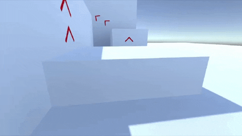

## Introductión

A example FPS with Parkour mechanics inspired by Mirror's Edge made in Unity written in C#

## Table Contents

• - Requirements [Can i runt i?](#Requirements)
    -
• -  Key Features: [New?](#Key-Features) 
    -
• -  Screenshots: [Ideas and Support?](#Screenshots)
  
   
##  1. Requirements:

- Platform: Windows, macOS, or Linux
-   Unity Version: Unity 2019.1.0 or higher
-   Storage: 300 mb GB free space
-   Controller Recommended: Immerse yourself in the "Mirror's Edge" experience with a game controller.

## 2. Key Features:

Dive into the gameplay with these exciting features:

- High-Speed Parkour: Master parkour skills and race through a stunning urban world.
- Daring Leaps: Overcome dizzying challenges as you leap between buildings and perform breathtaking stunts.
- Stylish Graphics: Enjoy a visually stunning environment with a unique and modern style.
- Mystery-Wrapped Story: Delve into a story full of twists and mysteries that will keep you captivated.
- Version Compatibility: This project is developed in Unity version 20XX.X.X. Ensure you have the correct Unity version installed for a seamless gaming experience.

## Screenshots

See the game in action with these captivating screenshots:

